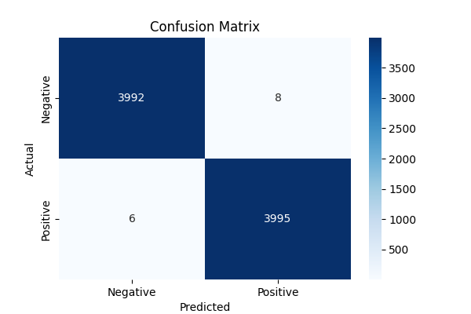
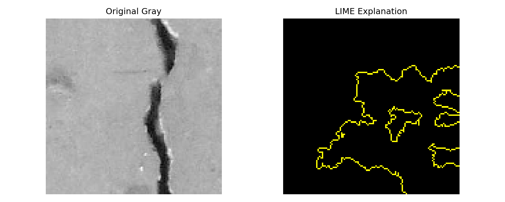

# Surface Crack Detection

## 📄 Description

**Surface Crack Detection** is a machine learning project aimed at automatically identifying cracks on surface images.

**Confusion Matrix**

## 🚀 Features

- **Data Preprocessing:** Loading, resizing, and normalizing images.
- **Model Training:** Development and training of a CNN for image classification.
- **Model Evaluation:** Assessing model performance with metrics and visualizations.
- **Image Classification** Uploading and classifying
- **Explainability (LIME):** Generating visual explanations showing which regions of an image the model relies on when predicting cracks.

**Example LIME Explanation**  
Below is a sample visualization using LIME, highlighting important superpixels contributing to the “Positive” (crack) classification:

## Dataset

The dataset comprises images categorized into two classes:

- **Positive:** Images containing surface cracks.
- **Negative:** Images without surface cracks.

Özgenel, Çağlar Fırat (2019), “Concrete Crack Images for Classification”, Mendeley Data, V2,
[doi: http://dx.doi.org/10.17632/5y9wdsg2zt.2x](https://data.mendeley.com/datasets/5y9wdsg2zt/2)

<!-- https://www.kaggle.com/datasets/arunrk7/surface-crack-detection>

<!-- Ausführungsschritte
    - source crack_env/bin/activate
    - python3 src/data_preprocessing.py
    - python3 src/eda.py
    - python3 src/model.py
    - python3 src/train.py
    - python3 src/evaluate.py
    - python3 src/predict.py test/TestCrack.jpeg
    - python3 src/predict.py test/TestCrack2.jpg
    - python3 src/explain.py test/TestCrack.jpeg
>
